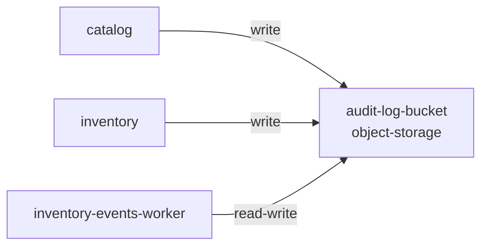

# Resource: audit-log-bucket

> Resource catalog detail

Metadata

- **Application:** Inventory Hub
- **Version:** flightplan/v1
- **report:** resource-catalog
- **generated-by:** flightplan
- **resource:** audit-log-bucket

---

## Resource: audit-log-bucket

Back to [Resource Catalog](index.md).

Kind: object-storage · Owner: backend · Platform: aws/s3 · Zone: restricted.

### Dependency graph

Services that depend on this resource.

### Consumers (3)

| Service | Access | Details |
| --- | --- | --- |
| catalog | write — Writes or modifies data. | cross-zone (service in internal, resource in restricted) |
| inventory | write — Writes or modifies data. | cross-zone (service in internal, resource in restricted) |
| inventory-events-worker | read-write — Reads and writes data. |  |

