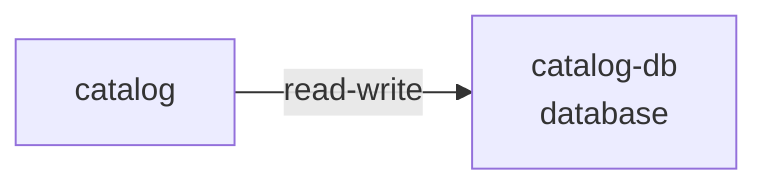

# Resource: catalog-db

> Resource catalog detail

Metadata

- **Application:** Inventory Hub
- **Version:** flightplan/v1
- **report:** resource-catalog
- **generated-by:** flightplan
- **resource:** catalog-db

---

## Resource: catalog-db

Back to [Resource Catalog](index.md).

Kind: database · Owner: backend · Platform: aws/rds-postgresql · Zone: restricted.

### Dependency graph

Services that depend on this resource.

### Consumers (1)

| Service | Access | Details |
| --- | --- | --- |
| catalog | read-write — Reads and writes data. | cross-zone (service in internal, resource in restricted) |

