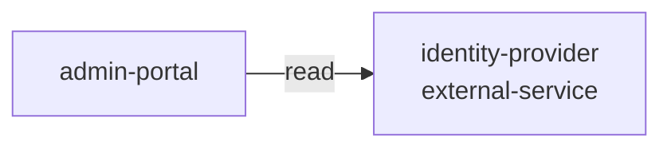

# Resource: identity-provider

> Resource catalog detail

Metadata

- **Application:** Inventory Hub
- **Version:** flightplan/v1
- **report:** resource-catalog
- **generated-by:** flightplan
- **resource:** identity-provider

---

## Resource: identity-provider

Back to [Resource Catalog](index.md).

Kind: external-service · Owner: api · Platform: auth0 · Zone: external.

### Dependency graph

Services that depend on this resource.

### Consumers (1)

| Service | Access | Details |
| --- | --- | --- |
| admin-portal | read — Reads data but does not modify it. | cross-zone (service in public, resource in external) |

