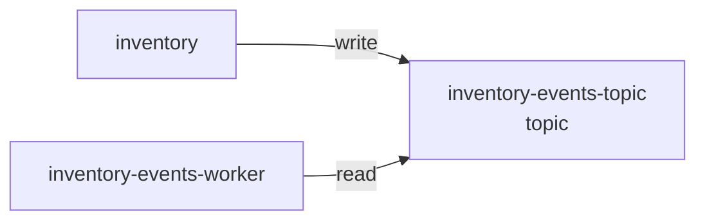

# Resource: inventory-events-topic

> Resource catalog detail

Metadata

- **Application:** Inventory Hub
- **Version:** flightplan/v1
- **report:** resource-catalog
- **generated-by:** flightplan
- **resource:** inventory-events-topic

---

## Resource: inventory-events-topic

Back to [Resource Catalog](index.md).

Kind: topic · Owner: backend · Platform: aws/sns · Zone: internal.

### Dependency graph

Services that depend on this resource.

### Consumers (2)

| Service | Access | Details |
| --- | --- | --- |
| inventory | write — Writes or modifies data. |  |
| inventory-events-worker | read — Reads data but does not modify it. | cross-zone (service in restricted, resource in internal) |

