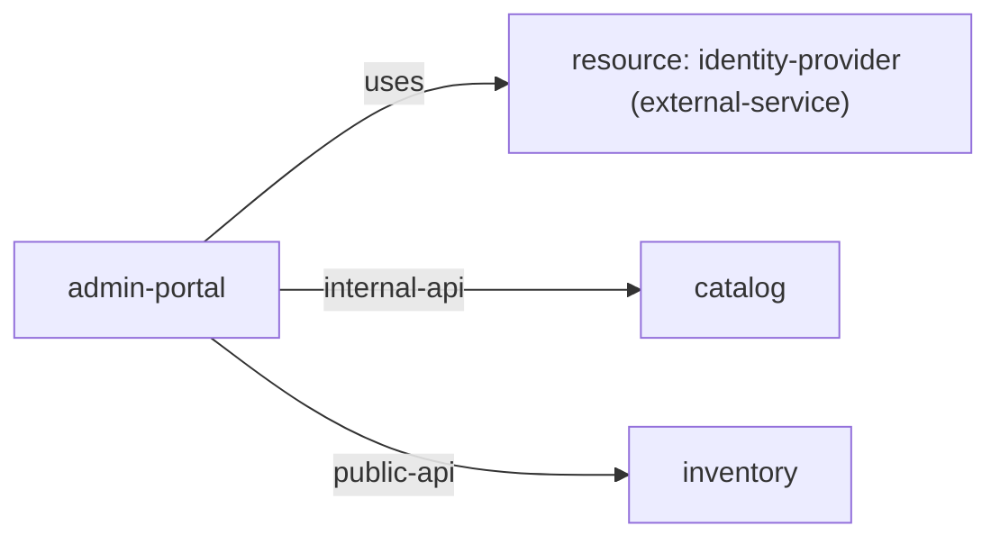

# Service: admin-portal

> Service catalog detail

Metadata

- **Application:** Inventory Hub
- **Version:** flightplan/v1
- **report:** service-catalog
- **generated-by:** flightplan
- **service:** admin-portal

---

## Service: admin-portal

Back to [Service Catalog](index.md).

Owner: frontend · Platform: react · Zone: public.

### Dependency graph

Inbound and outbound dependencies for this service.

### Exports (0)

None.

### Outbound dependencies (3)

| Kind | Target | Export | Access | Details |
| --- | --- | --- | --- | --- |
| service-to-resource | identity-provider |  | read — Reads data but does not modify it. | kind external-service |
| service-to-service | catalog | internal-api |  | protocol https, internal, auth oauth2 |
| service-to-service | inventory | public-api |  | protocol https, external, auth oauth2 |

### Inbound dependencies (0)

None.

