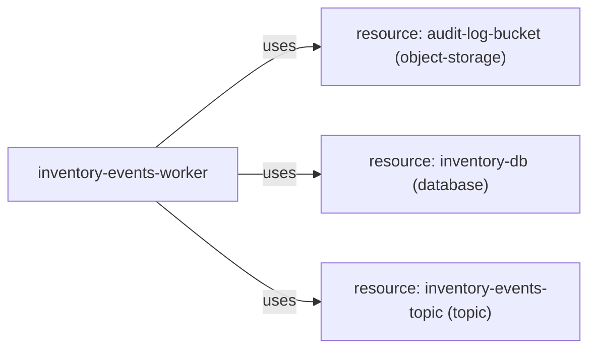

# Service: inventory-events-worker

> Service catalog detail

Metadata

- **Application:** Inventory Hub
- **Version:** flightplan/v1
- **report:** service-catalog
- **generated-by:** flightplan
- **service:** inventory-events-worker

---

## Service: inventory-events-worker

Back to [Service Catalog](index.md).

Owner: backend · Platform: python · Zone: restricted.

### Dependency graph

Inbound and outbound dependencies for this service.

### Exports (0)

None.

### Outbound dependencies (3)

| Kind | Target | Export | Access | Details |
| --- | --- | --- | --- | --- |
| service-to-resource | audit-log-bucket |  | read-write — Reads and writes data. | kind object-storage |
| service-to-resource | inventory-db |  | read — Reads data but does not modify it. | kind database |
| service-to-resource | inventory-events-topic |  | read — Reads data but does not modify it. | kind topic |

### Inbound dependencies (0)

None.

