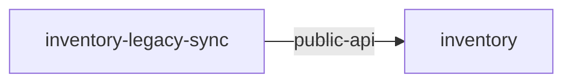

# Service: inventory-legacy-sync

> Service catalog detail

Metadata

- **Application:** Inventory Hub
- **Version:** flightplan/v1
- **report:** service-catalog
- **generated-by:** flightplan
- **service:** inventory-legacy-sync

---

## Service: inventory-legacy-sync

Back to [Service Catalog](index.md).

Owner: backend · Platform: (none) · Zone: internal.

### Dependency graph

Inbound and outbound dependencies for this service.

### Exports (0)

None.

### Outbound dependencies (1)

| Kind | Target | Export | Access | Details |
| --- | --- | --- | --- | --- |
| service-to-service | inventory | public-api |  | protocol https, external, auth oauth2 |

### Inbound dependencies (0)

None.

