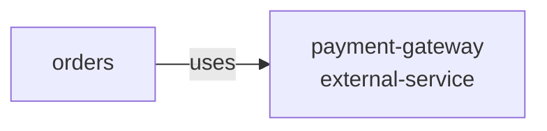

# Resource: payment-gateway

> Resource catalog detail

Metadata

- **Application:** Shopping Sample App
- **Version:** flightplan/v1
- **report:** resource-catalog
- **generated-by:** flightplan
- **resource:** payment-gateway

---

## Resource: payment-gateway

Back to [Resource Catalog](index.md).

Kind: external-service · Owner: backend · Platform: stripe/payments · Zone: external.

### Dependency graph

Services that depend on this resource.

### Consumers (1)

| Service | Access | Details |
| --- | --- | --- |
| orders |  | cross-zone (service in internal, resource in external) |

