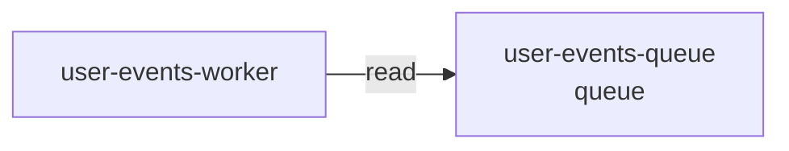

# Resource: user-events-queue

> Resource catalog detail

Metadata

- **Application:** Shopping Sample App
- **Version:** flightplan/v1
- **report:** resource-catalog
- **generated-by:** flightplan
- **resource:** user-events-queue

---

## Resource: user-events-queue

Back to [Resource Catalog](index.md).

Kind: queue · Owner: backend · Platform: aws/sqs · Zone: internal.

### Dependency graph

Services that depend on this resource.

### Consumers (1)

| Service | Access | Details |
| --- | --- | --- |
| user-events-worker | read — Reads data but does not modify it. | cross-zone (service in restricted, resource in internal) |

