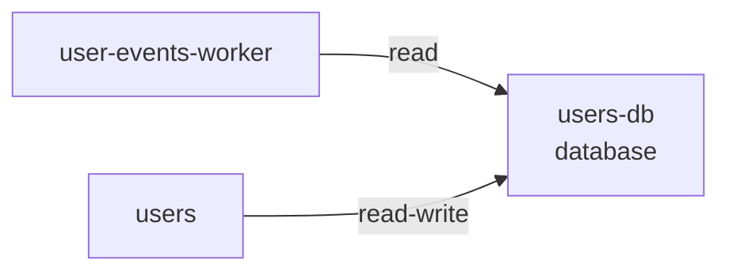

# Resource: users-db

> Resource catalog detail

Metadata

- **Application:** Shopping Sample App
- **Version:** flightplan/v1
- **report:** resource-catalog
- **generated-by:** flightplan
- **resource:** users-db

---

## Resource: users-db

Back to [Resource Catalog](index.md).

Kind: database · Owner: backend · Platform: aws/rds-postgresql · Zone: restricted.

### Dependency graph

Services that depend on this resource.

### Consumers (2)

| Service | Access | Details |
| --- | --- | --- |
| user-events-worker | read — Reads data but does not modify it. |  |
| users | read-write — Reads and writes data. | cross-zone (service in internal, resource in restricted) |

