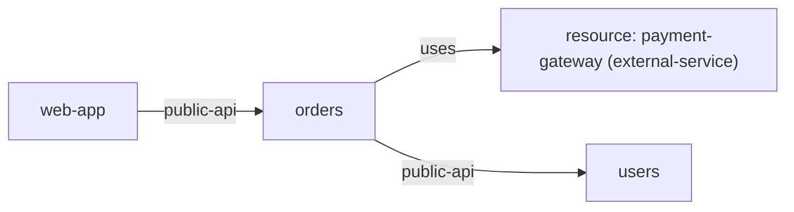

# Service: orders

> Service catalog detail

Metadata

- **Application:** Shopping Sample App
- **Version:** flightplan/v1
- **report:** service-catalog
- **generated-by:** flightplan
- **service:** orders

---

## Service: orders

Back to [Service Catalog](index.md).

Owner: api · Platform: dotnet · Zone: internal.

### Dependency graph

Inbound and outbound dependencies for this service.

### Exports (1)

| Export | Protocol | Visibility | Auth | Consumers | Classifications |
| --- | --- | --- | --- | --- | --- |
| public-api | https — HTTP over TLS (standard for web APIs and browsers). | external — Callable by external consumers; treat as a primary ingress surface. | oauth2 — OAuth 2.0 (often with OIDC) for delegated authorization via access tokens. |  |  |

### Outbound dependencies (2)

| Kind | Target | Export | Access | Details |
| --- | --- | --- | --- | --- |
| service-to-resource | payment-gateway |  |  | kind external-service |
| service-to-service | users | public-api |  | protocol https, external, auth oauth2 |

### Inbound dependencies (1)

| Caller | Calls Export | Access | Details |
| --- | --- | --- | --- |
| web-app | public-api |  | protocol https, external, auth oauth2 |

