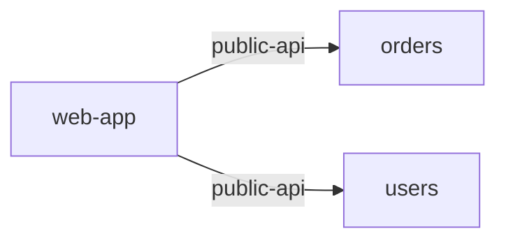

# Service: web-app

> Service catalog detail

Metadata

- **Application:** Shopping Sample App
- **Version:** flightplan/v1
- **report:** service-catalog
- **generated-by:** flightplan
- **service:** web-app

---

## Service: web-app

Back to [Service Catalog](index.md).

Owner: frontend · Platform: vue/3 · Zone: public.

### Dependency graph

Inbound and outbound dependencies for this service.

### Exports (0)

None.

### Outbound dependencies (2)

| Kind | Target | Export | Access | Details |
| --- | --- | --- | --- | --- |
| service-to-service | orders | public-api |  | protocol https, external, auth oauth2 |
| service-to-service | users | public-api |  | protocol https, external, auth oauth2 |

### Inbound dependencies (0)

None.

